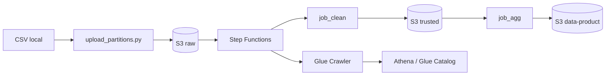

# Data Mesh — Análise de Sentimento

Pipeline de dados na AWS para ingerir reviews de e-commerce, limpar, agregar sentimento por faixa etária e expor um data product consultável via Athena.

## Arquitetura



| Camada | Bucket | Conteúdo |
|---|---|---|
| **raw** | `...-raw-...` | CSVs particionados por `dt=YYYY-MM-DD` |
| **trusted** | `...-trusted-...` | Reviews limpos em Parquet + `age_band` |
| **data-product** | `...-data-product-...` | Agregação `customer_sentiment_by_age` |

**Orquestração:** Step Function executa `job_clean` → `job_agg` → crawler → validação Athena.

**Governança:** Lake Formation controla quem acessa cada database (ex.: Marketing só vê `customer_sentiment`).

## Estrutura do repositório

```
├── glue_jobs/              # Scripts PySpark (job_clean, job_agg, transforms)
├── scripts/                # upload_partitions.py — ingestão no S3 raw
├── terraform/
│   ├── bootstrap/          # State S3 + lock DynamoDB
│   ├── modules/            # s3, iam, lake_formation, glue, step_functions
│   └── environments/dev/   # Ambiente de desenvolvimento
├── tests/                  # Validadores automatizados por sprint
└── data/                   # CSV local (não versionado)
```

## Pré-requisitos

- Python 3.10+
- Terraform >= 1.5
- AWS CLI configurado (`AWS_PROFILE=nova-conta` ou equivalente)
- Permissões para S3, Glue, Step Functions, Athena, Lake Formation

## Início rápido

### 1. Instalar dependências

```bash
pip install -r requirements.txt
```

### 2. Provisionar infraestrutura

```bash
cd terraform/bootstrap && terraform init && terraform apply
cd ../environments/dev && terraform init && terraform apply
```

### 3. Ingerir dados

Coloque o CSV em `data/Womens Clothing E-Commerce Reviews.csv` e rode:

```bash
python scripts/upload_partitions.py --bucket SEU-BUCKET-RAW
```

### 4. Executar a pipeline

```bash
export AWS_PROFILE=nova-conta

aws stepfunctions start-execution \
  --state-machine-arn arn:aws:states:us-east-1:CONTA:stateMachine:data-mesh-sentimento-dev-sentiment-pipeline \
  --input '{
    "dt": "2024-01-01",
    "bucket_raw": "data-mesh-sentimento-dev-raw-CONTA",
    "bucket_trusted": "data-mesh-sentimento-dev-trusted-CONTA",
    "bucket_product": "data-mesh-sentimento-dev-data-product-CONTA"
  }'
```

Substitua `CONTA` pelo ID da sua AWS account. Valores reais:

```bash
cd terraform/environments/dev
terraform output state_machine_arn
terraform output -json pipeline_input_example
```

> Git Bash: quebra de linha com `\`. PowerShell: use `` ` ``.

### 5. Consultar resultado (Athena)

```sql
SELECT *
FROM customer_sentiment.customer_sentiment_by_age
WHERE dt = DATE '2024-01-01'
LIMIT 20;
```

## Validação automatizada

| Script | Sprint |
|---|---|
| `python tests/validate_acceptance.py` | S1-01 — S3 + IAM |
| `python tests/validate_lake_formation.py` | S1-02 — Lake Formation |
| `python tests/validate_s1_03.py` | S1-03 — Glue Jobs |
| `python tests/validate_s1_04.py` | S1-04 — Upload particionado |
| `python tests/validate_s2_01.py` | S2-01 — Step Functions (inclui E2E) |

## Onde verificar na AWS

| Serviço | O que checar |
|---|---|
| **Step Functions** | Execuções `Succeeded` / `Failed` |
| **Glue** | Runs de `job-clean`, `job-agg` e crawler |
| **S3** | Parquet em `trusted/` e `data-product/` |
| **Athena** | Query na tabela `customer_sentiment_by_age` |
| **CloudWatch** | Logs em `/aws/vendedlogs/states/...-sentiment-pipeline` |

## Regras de negócio (resumo)

- **age_band:** Jovem, Adulto, Madura, Sênior
- **sentiment:** Positivo, Neutro, Negativo (por `rating` + `recommended_ind`)
- **EmptyPartition:** pipeline falha se Athena retornar `COUNT=0` no data-product
