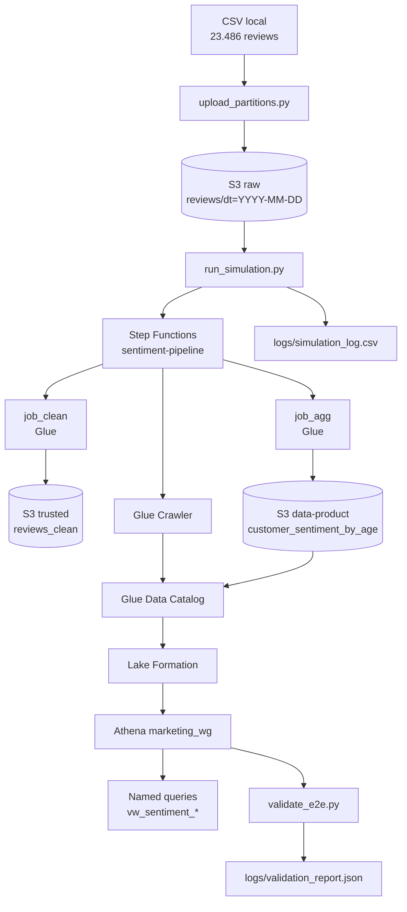

# Data Mesh — Análise de Sentimento

Pipeline de dados na AWS para ingerir reviews de e-commerce, limpar, agregar sentimento por faixa etária e expor um data product consultável via Athena no workgroup `marketing_wg`.

## Arquitetura



| Camada | Bucket | Conteúdo |
|---|---|---|
| **raw** | `data-mesh-sentimento-dev-raw-{account}` | CSVs particionados por `dt=YYYY-MM-DD` |
| **trusted** | `data-mesh-sentimento-dev-trusted-{account}` | Reviews limpos em Parquet + `age_band` |
| **data-product** | `data-mesh-sentimento-dev-data-product-{account}` | Agregação `customer_sentiment_by_age` |
| **athena-results** | `data-mesh-sentimento-dev-athena-results-{account}` | Resultados de queries (`marketing/`) |

**Orquestração:** Step Functions executa `job_clean` → polling → `job_agg` → polling → crawler → validação Athena (`COUNT` no data-product).

**Governança:** Lake Formation controla acesso por domínio (`athena_role` só consulta `customer_sentiment` via `marketing_wg`).

## Estrutura do repositório

```
data-mesh-analise-sentimento/
├── glue_jobs/                    # Scripts PySpark (job_clean, job_agg, transforms)
├── scripts/
│   ├── upload_partitions.py      # S1-04 — ingestão particionada no S3 raw
│   ├── run_simulation.py         # S2-03 — simulação sequencial (235 lotes)
│   └── validate_e2e.py           # S2-04 — validação E2E no Athena
├── terraform/
│   ├── bootstrap/                # Bucket tfstate + DynamoDB lock
│   ├── modules/
│   │   ├── s3/                   # Buckets raw, trusted, data-product
│   │   ├── iam/                  # Roles glue, sfn, athena
│   │   ├── lake_formation/       # Databases, tabela, permissões LF
│   │   ├── glue/                 # Jobs, crawler, scripts no S3
│   │   ├── step_functions/       # State machine + ASL
│   │   └── athena/               # marketing_wg, named queries, views.sql
│   └── environments/dev/         # Stack de desenvolvimento
├── tests/                        # Validadores automatizados por sprint
├── logs/                         # Gerado em runtime (não versionado)
│   ├── simulation_log.csv
│   └── validation_report.json
├── data/                         # CSV local (não versionado)
├── requirements.txt
└── README.md
```

## Pré-requisitos

| Ferramenta | Versão mínima |
|---|---|
| **Terraform** | >= 1.5 |
| **AWS CLI** | v2 configurado (`aws sts get-caller-identity`) |
| **Python** | 3.9+ (recomendado 3.10+) |
| **Dependências** | `pip install -r requirements.txt` |

### Configuração local (não versionada)

Arquivos sensíveis ou específicos da máquina **não entram no git** (ver `.gitignore`):

```bash
# Variáveis Terraform do ambiente dev
cp terraform/environments/dev/terraform.tfvars.example terraform/environments/dev/terraform.tfvars

# Perfil AWS local (opcional)
cp .env.example .env
```

| Artefato | Versionado? | Descrição |
|---|---|---|
| `terraform.tfvars.example` | Sim | Modelo de variáveis |
| `terraform.tfvars` | **Não** | Valores do seu ambiente |
| `.env.example` | Sim | Modelo de perfil AWS |
| `.env` | **Não** | Credenciais/perfil local |
| `data/` | **Não** | CSV do Kaggle |
| `logs/` | **Não** | Saídas de simulação e E2E |
| `.terraform.lock.hcl` | **Sim** | Lock de providers |

Permissões AWS necessárias: S3, IAM, Glue, Lake Formation, Step Functions, Athena, CloudWatch Logs.

## Provisionamento Terraform (do zero)

A ordem abaixo reflete as dependências entre módulos em `terraform/environments/dev/main.tf`.

### 1. Bootstrap (state remoto)

```bash
cd terraform/bootstrap
terraform init
terraform apply
```

Cria o bucket de state e a tabela DynamoDB de lock.

### 2. Ambiente dev (stack completa)

```bash
cd terraform/environments/dev
cp terraform.tfvars.example terraform.tfvars   # se ainda não existir
terraform init
terraform plan
terraform apply
```

Módulos aplicados nesta ordem (via `depends_on`):

1. **s3** — buckets raw, trusted, data-product
2. **iam** — roles `glue`, `sfn`, `athena`
3. **lake_formation** — databases `reviews_trusted`, `customer_sentiment`, tabela, grants
4. **glue** — `job_clean`, `job_agg`, crawler, upload de scripts
5. **step_functions** — state machine `sentiment-pipeline`
6. **athena** — workgroup `marketing_wg`, named queries, bucket de resultados

Obter outputs:

```bash
terraform output state_machine_arn
terraform output -json bucket_ids
terraform output athena_workgroup_name
terraform output -json pipeline_input_example
```

## Fluxo de execução

### Passo 1 — Upload das 235 partições (S1-04)

Coloque o CSV em `data/Womens Clothing E-Commerce Reviews.csv` e execute:

```bash
python scripts/upload_partitions.py \
  --bucket data-mesh-sentimento-dev-raw-SEU_ACCOUNT_ID
```

Gera 235 partições `dt=2024-01-01` … `dt=2024-08-22` (100 reviews por lote).

### Passo 2 — Simulação sequencial (S2-03)

```bash
python scripts/run_simulation.py \
  --state-machine-arn "$(terraform -chdir=terraform/environments/dev output -raw state_machine_arn)" \
  --bucket-raw "$(terraform -chdir=terraform/environments/dev output -json bucket_ids | jq -r .raw)" \
  --bucket-trusted "$(terraform -chdir=terraform/environments/dev output -json bucket_ids | jq -r .trusted)" \
  --bucket-product "$(terraform -chdir=terraform/environments/dev output -json bucket_ids | jq -r '."data-product"')"
```

Opções úteis:

- `--dry-run` — lista partições sem executar
- `--start-from 2024-03-01` — retoma a partir de uma data

Log gerado: `logs/simulation_log.csv`

### Passo 3 — Validação E2E (S2-04)

Após a simulação completa:

```bash
python scripts/validate_e2e.py
```

Executa 6 checks no Athena (`marketing_wg`) e gera `logs/validation_report.json`.

| Check | Query | Esperado |
|---|---|---|
| 1 | `COUNT(DISTINCT dt)` | 235 |
| 2 | `DISTINCT age_band` | 4 valores |
| 3 | `DISTINCT sentiment` | 3 valores |
| 4 | `age_band IS NULL` | 0 |
| 5 | `sentiment IS NULL` | 0 |
| 6 | `MIN(dt)`, `MAX(dt)` | `2024-01-01` … `2024-08-22` |

> **Nota sobre datas:** 235 lotes a partir de `2024-01-01` terminam em `2024-08-22` (não `2024-08-23`). O script calcula o `MAX(dt)` esperado automaticamente.

Exit code: `0` se todos PASS, `1` se algum FAIL.

### Passo 4 — Consultas analíticas (S2-02)

No Athena, selecione o workgroup **`marketing_wg`** → **Consultas salvas**:

- `vw_sentiment_by_age`
- `vw_sentiment_by_dept`
- `vw_daily_trend`

## Data Product — `customer_sentiment_by_age`

**Database:** `customer_sentiment`  
**Formato:** Parquet  
**Partição:** `dt` (date)

| Coluna | Tipo | Descrição |
|---|---|---|
| `age_band` | string | Faixa etária do cliente |
| `department_name` | string | Departamento do produto |
| `sentiment` | string | Classificação de sentimento |
| `review_count` | int | Quantidade de reviews na célula |
| `avg_rating` | double | Média de rating (2 casas decimais) |
| `dt` | date | Partição diária (chave Hive) |

**Parâmetros Glue:** `owner=data-team`, `sla=30min`, `domain=marketing`

## Regras de negócio

### Faixa etária (`age_band`)

| Idade | Faixa |
|---|---|
| 18–29 | Jovem |
| 30–44 | Adulto |
| 45–59 | Madura |
| 60+ | Sênior |

Idades &lt; 18 ou inválidas → `NULL` (excluídas na agregação).

Implementação: `glue_jobs/transforms.py` → `age_band()`

### Sentimento (`sentiment`)

| Condição | Sentimento |
|---|---|
| `rating >= 4` **e** `recommended_ind == 1` | Positivo |
| `rating == 3` | Neutro |
| Demais casos | Negativo |

Implementação: `glue_jobs/transforms.py` → `sentiment()`

## Validação automatizada

| Script | Sprint |
|---|---|
| `python tests/validate_acceptance.py` | S1-01 — S3 + IAM |
| `python tests/validate_lake_formation.py` | S1-02 — Lake Formation |
| `python tests/validate_s1_03.py` | S1-03 — Glue Jobs |
| `python tests/validate_s1_04.py` | S1-04 — Upload particionado |
| `python tests/validate_s2_01.py` | S2-01 — Step Functions |
| `python tests/validate_s2_02.py` | S2-02 — Athena Marketing |
| `python tests/validate_s2_03.py` | S2-03 — Simulação sequencial |
| `python tests/validate_s2_04.py` | S2-04 — E2E + README |

## Troubleshooting

### 1. `EmptyPartition` na Step Function

**Causa:** Não há dados no S3 raw para o `dt` informado, ou o CSV da partição está vazio após o `job_clean`.

**Solução:** Confirme `aws s3 ls s3://BUCKET_RAW/reviews/dt=YYYY-MM-DD/`. Rode `upload_partitions.py` se a partição não existir.

### 2. `HIVE_INVALID_METADATA` / coluna `dt` duplicada no Athena

**Causa:** O `job_agg` gravou `dt` dentro do Parquet **e** como partição S3, gerando schema conflitante no Glue Catalog.

**Solução:** Reaplique o Terraform/Glue com a versão atual do `job_agg.py` (sem coluna `dt` no corpo do Parquet). Rode o crawler novamente.

### 3. `AccessDeniedException` no Athena para `athena_role`

**Causa:** Tentativa de usar workgroup `primary` ou database `reviews_trusted` sem grant no Lake Formation.

**Solução:** Use o workgroup **`marketing_wg`** e o database **`customer_sentiment`**. Verifique grants com `python tests/validate_lake_formation.py`.

### 4. Named queries não aparecem no console Athena

**Causa:** Console está no workgroup `primary` ou buscando views no Glue em vez de consultas salvas.

**Solução:** Selecione **`marketing_wg`** no canto superior direito → **Consultas salvas**.

### 5. `validate_e2e.py` CHECK 1 falha (menos de 235 `dt` distintos)

**Causa:** Simulação incompleta — `run_simulation.py` não processou todas as partições.

**Solução:** Verifique `logs/simulation_log.csv` por linhas `FAILED`. Retome com `--start-from DATA_DA_FALHA`. Aguarde a simulação completa antes do E2E.

### 6. Glue crawler preso em `STOPPING`

**Causa:** Execução anterior do crawler ainda finalizando quando a Step Function consulta o status.

**Solução:** A state machine já trata `STOPPING` com wait/retry. Se persistir, pare o crawler manualmente no console Glue e reexecute a partição.

### 7. `ConcurrentRunsExceededException` no Glue

**Causa:** Múltiplas execuções simultâneas do mesmo job (não deveria ocorrer com `run_simulation.py` sequencial).

**Solução:** Aguarde jobs em execução terminarem. O script de simulação já aguarda cada execução antes da próxima.

## Onde verificar na AWS

| Serviço | Recurso | O que checar |
|---|---|---|
| **S3** | `...-raw-.../reviews/` | 235 pastas `dt=` |
| **Step Functions** | `data-mesh-sentimento-dev-sentiment-pipeline` | Execuções `sim-*` Succeeded |
| **Glue** | `job-clean`, `job-agg`, crawler | Runs bem-sucedidos |
| **Athena** | workgroup `marketing_wg` | Consultas salvas e resultados |
| **CloudWatch** | `/aws/vendedlogs/states/...-sentiment-pipeline` | Logs da pipeline |

## Conta de referência

- **Região:** `us-east-1`
- **Account ID (dev):** `082846230365`

Substitua pelo ID da sua conta nos comandos acima.
